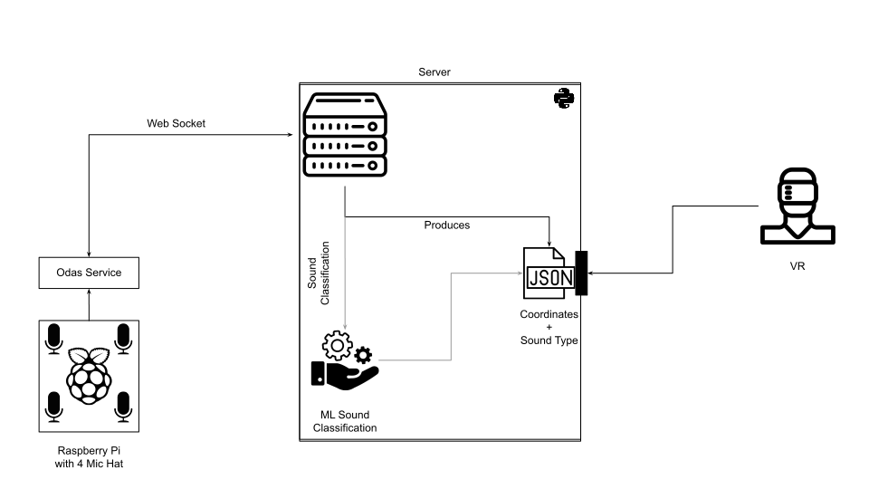

# vr-passthrough-sound-localization
- Direction of Arrival
## Hardware
Respeaker 4-Mic Array: https://github.com/SeeedDocument/ReSpeaker-4-Mic-Array-for-Raspberry-Pi

## Setup Guide
### Raspberry Pi
#### Microphone
1. Mount Respeaker onto Raspberry Pi
2. Get Seed voice card source code + install all relevant drivers: https://gitlab.ethz.ch/aweichbrodt/seeed-voicecard. 
Use `sudo ./install.sh --compat-kernel`
3. Get and install ODAS library: https://github.com/introlab/odas
4. Fine tune `/src/pi/config_file.cfg` to your needs
5. Execute `./odaslive -c config_file.cfg`
6. (Optional) Use ODAS Web for visualization: https://github.com/introlab/odas_web

### Server
Make sure to edit the .env file and add fill in the necessary fields.
#### Socket_server.py
Start the web socket server: `python socket_server.py`
#### File Transfer
[More details here](./src/server/filetransfer/README.md)
## Architecture

## Sample Output
JSON File
{
"sounds":
  [
    {
      "direction": 
        {"x": 0.388, "y": 0.364, "z": 0.847},
        "type": "VOICE"
    }
  ]
}
